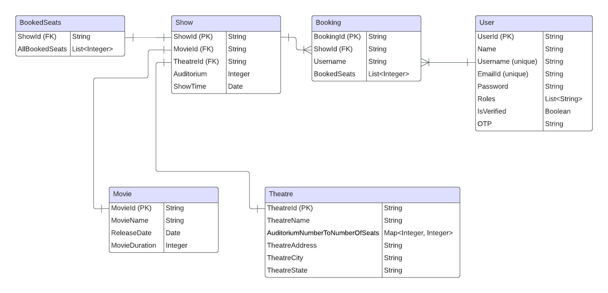

<!-- ABOUT THE PROJECT -->

# Movie Booking Service

REST APIs to get different movies in various cities made using Spring Boot framework, Mongo Database, and Redis Cache. JSON Web Token have been used for authentication and authorization.

<hr>

<!-- GETTING STARTED -->

## Getting Started

Please follow the code snippets below to set up the environment for running the project on the local machine.

### Prerequisites

* <b>Maven</b>

  This <a href="https://www.digitalocean.com/community/tutorials/install-maven-linux-ubuntu">reference</a> can also be used for installing maven on the local system.

  ```sh
  > sudo apt update
  > sudo apt install maven
  > mvn -version
  ```
* <b>MongoDB</b>

  This <a href="https://www.mongodb.com/docs/manual/tutorial/install-mongodb-on-ubuntu/">reference</a> can also be used to install MongoDB.

  ```sh
  > sudo apt-get install gnupg curl
  > curl -fsSL https://pgp.mongodb.com/server-7.0.asc | \
   sudo gpg -o /usr/share/keyrings/mongodb-server-7.0.gpg \
   --dearmor
  > echo "deb [ arch=amd64,arm64 signed-by=/usr/share/keyrings/mongodb-server-7.0.gpg ] https://repo.mongodb.org/apt/ubuntu jammy/mongodb-org/7.0 multiverse" | sudo tee /etc/apt/sources.list.d/mongodb-org-7.0.list
  > sudo apt-get update
  > sudo apt-get install -y mongodb-org
  > mongo --version
  ```
* <b>Redis</b>

  This <a href="https://redis.io/docs/install/install-redis/install-redis-on-linux/">reference</a> can also be used to install Redis.

  ```sh
  > curl -fsSL https://packages.redis.io/gpg | sudo gpg --dearmor -o /usr/share/keyrings/redis-archive-keyring.gpg
  > echo "deb [signed-by=/usr/share/keyrings/redis-archive-keyring.gpg] https://packages.redis.io/deb $(lsb_release -cs) main" | sudo tee /etc/apt/sources.list.d/redis.list
  > sudo apt-get update
  > sudo apt-get install redis
  ```

### Installation

<i>Ensure that <b>mongodb</b> is running on <b>mongodb://localhost:27017</b> and <b>redis</b> running on <b>localhost:6379</b>.</i>

1. Clone the repo
   ```sh
   git clone https://github.com/kaustubh0201/Movie-Booking.git
   ```
2. Install `maven dependencies` from `pom.xml` file.
   ```sh
   mvn install
   ```
3. Start the spring boot application
   ```sh
   mvn spring-boot:run
   ```
4. Generating javadoc for the application
   ```sh
   mvn javadoc:javadoc
   ```

## Database Design

<p align="center">
   
</p>

<hr>

* User Schema

```sh
{
  "userId": ObjectId("..."),       // Automatically generated by MongoDB
  "name": "User's Name",
  "username": "unique_username",
  "emailId": "user@example.com",
  "password": "hashed_password",
  "roles": ["role1", "role2"],     // Array of roles assigned to the user
  "isVerified": true,              // Boolean indicating if the user is verified
  "otp": "123456",                 // One-time password for verification
}
```

<hr>

* Theatre Schema

```sh
{
  "theatreId": ObjectId("..."),           // Automatically generated by MongoDB
  "theatreName": "Theatre Name",
  "auditoriumNumberToNumberOfSeats": {
    "1": 100,                             // Example: Auditorium 1 with 100 seats
    "2": 120,                             // Example: Auditorium 2 with 120 seats
    // Other auditoriums and seat counts
  },
  "theatreAddress": "Theatre Address",
  "theatreCity": "City Name",
  "theatreState": "State Name"
}

```

<hr>

* Show Schema

```sh
{
  "showId": ObjectId("..."),      // Automatically generated by MongoDB
  "movieId": "associated_movie_id",
  "theatreId": "associated_theatre_id",
  "auditorium": 1,                // Example: Auditorium number
  "showTime": ISODate("...")      // Example: Date and time when the show starts
}

```

<hr>

* Movie Schema

```sh
{
  "movieId": ObjectId("..."),      // Automatically generated by MongoDB
  "movieName": "Movie Name",
  "releaseDate": ISODate("..."),   // Date when the movie was released
  "movieDuration": 120             // Duration of the movie in minutes
}

```

<hr>

* Booking Schema

```sh
{
  "bookingId": ObjectId("..."),   // Automatically generated by MongoDB
  "showId": "associated_show_id",
  "username": "user_username",
  "bookedSeats": [1, 2, 3]        // Example: List of booked seat numbers
  // Other fields or properties not specified in the Booking class may also be present
}
```

<hr>

* Booked Seats Schema

```sh
{
  "showId": ObjectId("..."),       // Automatically generated by MongoDB
  "allBookedSeats": [1, 2, 3, ...] // List of all booked seat numbers for the show
  // Other fields or properties not specified in the BookedSeats class may also be present
}

```
